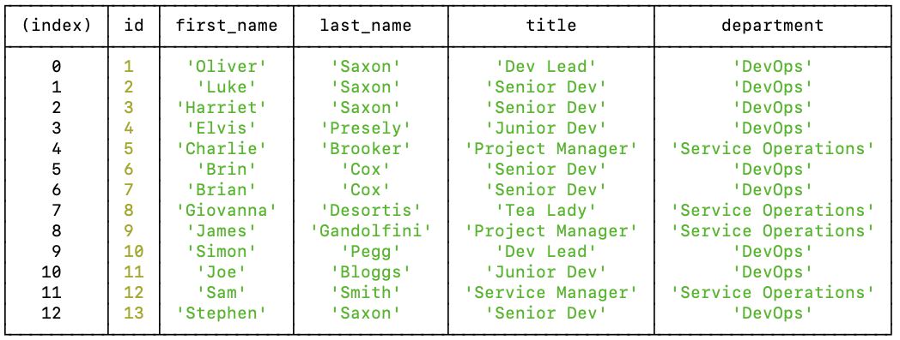

# Employee Tracker

## Description

Storing employee data is crucial to all companys and organisations. This application uses MySQL and Node.js to provide an easy to use command line interface for storing and viewing employee data. The app has functions to view, add and update employees, roles and departments and has a breakdown of spend per department based on the salary of the roles.

[Link to video demo](https://youtu.be/LA1tqsZK2j8)

  
# Table of Contents

  **[Installation Instructions](#intallation-instructions)** 
  **[Controbutors](#contributors)** 
  **[License Information](#license)** 
  
## Installation Instructions
Run node cms.js

  
## Contributors
Oli Saxon

  
# Questions

Visit my GitHub page [here](https://github.com/osaxon).

Email me with questions at [oliverrsaxon@gmail.com](oliverrsaxon@gmail.com).

